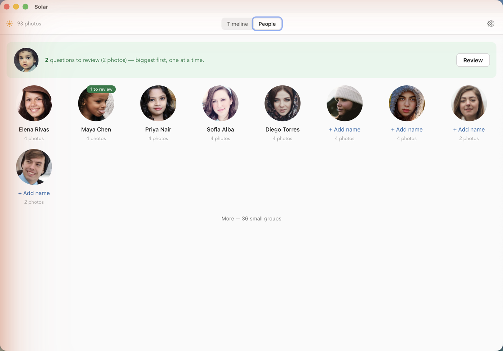
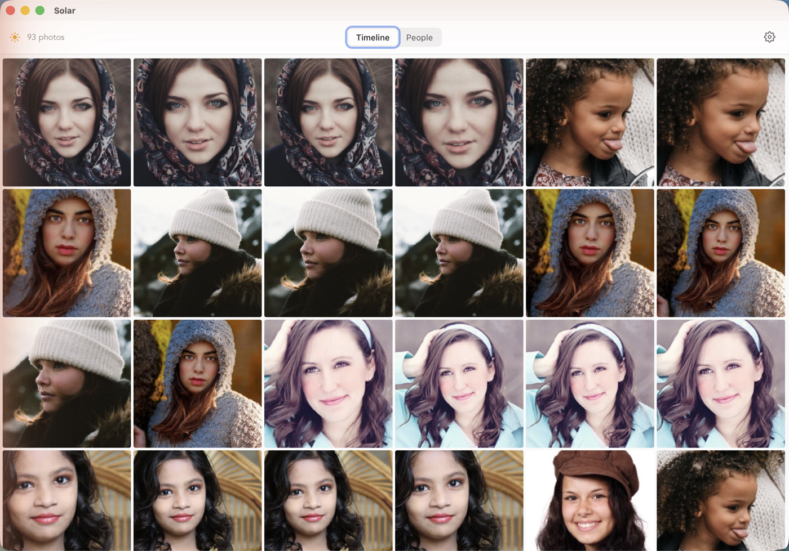

# Solar

**A fast, local-first photo manager for people who want to own their photos.**
No cloud, no account, no subscription — just your photos, on your machine, the
way Picasa used to feel.


<sub>Screenshots use a throwaway demo library of stock/AI-generated photos, not real photos — Solar never phones home either way.</sub>

---

Solar is an open-source desktop photo library manager in the spirit of Picasa:
fast, opinionated, and respectful of the person using it. It reads your photos
from your own drives, indexes a library of 100,000+ images, and shows them in a
buttery-smooth newest-first timeline. Your originals never move, never upload,
and never get locked into a proprietary format.

It's named for **güey** (*gway*), the Taíno word for the sun. A photograph is
captured light; Solar is where your light lives — on your machine, in your
hands, owned by you. *El sol es Taíno.* See **[NAME.md](NAME.md)**.

> **Status:** v1 — well past the "daily use" floor. Add your folders, fly through
> a newest-first timeline of 100,000+ photos, open any one full-screen, **find
> and name the people in them**, **see them laid out on a globe** — and trust
> that a relaunch shows the truth.

## What it does

- **Add your folders** (multiple); JPEG, HEIC, PNG and WebP are found
  **recursively** and remembered as library roots.
- **A timeline of your whole life in photos** — newest-first by EXIF capture
  date (file mtime fallback), with a right-edge **scrubber** that shows the
  current month as you fly through it.
- **60fps scrolling at 100k+ photos.** The grid is virtualized and streams in
  progressively without ever disturbing your scroll position.
- **The people in your photos — found on your machine.** Solar detects faces and
  groups each person into their own page as you browse. It's Picasa's face
  tagging, reborn — except the recognition runs **entirely on your computer** and
  never touches a cloud. No uploading your family to a server to get them sorted.
- **Name once, and it sticks.** Name a person and Solar remembers them durably —
  the name *and* the grouping survive every re-scan. A "merge all" nudge reunites
  the rest of someone's photos in a click, and the more you confirm, the more it
  pulls together. New people slide in with a gentle hello as they're found.
- **Your photos on a globe — that never phones home.** The **Places** tab plots
  every located photo on an interactive world map (a spinning globe that flattens
  as you zoom), clustered into thumbnail pins you can dive into. The map itself is
  **bundled in the app and read from disk** — no tile server, ever — so browsing
  where you've been is as private as everything else here. Locations come from
  your photos' own EXIF; nothing is looked up online.
- **Instant repeat launches.** Thumbnails are generated off the UI thread in a
  Rust backend and cached to disk, so the second launch shows your library
  immediately — no "loading your photos" wall.
- **A full-screen viewer.** Click any photo for an upright preview; ←/→ to move
  (neighbors prefetched), Esc to return to your exact place.
- **Cloud-aware, never cloud-dependent.** Cloud-only originals (Proton Drive,
  iCloud "dataless" files) are indexed instantly as placeholders and downloaded
  **on demand** as you scroll to them — never a bulk download — then cached.
- **A library you can trust.** Folders are remembered; every launch quietly
  reconciles with disk (plus a manual rescan in **Settings**), adding new files
  and pruning deleted ones — and never deleting anything if a drive is
  unreachable.



## What it will never do

Stating the limits is part of the promise. **Solar will never:**

- Phone home, send telemetry, or require an account.
- Upload your photos to a cloud or hold them for a subscription.
- **Send your photos — or your faces — to a server to be analyzed.** People are
  detected and grouped on your device, full stop.
- **Leak where you've been to a map provider.** The Places globe ships with the
  app and never contacts a tile server, so panning and zooming your history stays
  on your machine.
- Move or modify your originals, or lock them in a proprietary database.
- Become a full RAW darkroom or a professional cataloging suite.

These aren't missing features — they're the point. Staying opinionated is how
this stays good. (See [VISION.md](VISION.md) for *how we decide what not to
build*.)

## Why it exists

For the people currently underserved by Big Photo: the "I don't want my data on
Google or iCloud" crowd, the "I won't pay monthly for storage when I have a
backup drive" crowd, the "I just want to own my photos" crowd. The first user is
the person building it — the floor is that its own maker reaches for it daily.

The full philosophy lives in **[VISION.md](VISION.md)**, and the responsiveness
rules that govern every feature — *the user's place is sacred* — live in
**[PRINCIPLES.md](PRINCIPLES.md)**.

## Download & install

Grab the latest `.dmg` from **[Releases](https://github.com/o-fernandez/solar-photos/releases/latest)** — macOS on Apple Silicon, no Node/Rust toolchain required.

1. Open the `.dmg` and drag **Solar.app** into `/Applications`.
2. **First launch only:** this build is unsigned (no $99/year Apple developer
   account behind it yet), so macOS Gatekeeper will refuse to open it and call
   it damaged or from an "unidentified developer." This is a standard Gatekeeper
   quarantine flag, not an actual problem with the app. Clear it either way:
   - **Right-click (or Control-click) `Solar.app` → Open** → click **Open** again
     in the dialog. Only needed once.
   - Or: **System Settings → Privacy & Security**, scroll down, click
     **"Open Anyway"** next to the Solar warning.
3. It launches normally on every run after that.

Your library lives in app-data, not inside the `.app` bundle (see
[Architecture at a glance](#architecture-at-a-glance) below), so replacing
`Solar.app` with a newer build later never loses your photos or your named
people.

## Build from source

Prefer to build it yourself, or want to hack on it? Here's the dev setup.

### Prerequisites

- **Node.js** 18+ and npm
- **Rust** (stable) — <https://rustup.rs>

### Run it (development)

```sh
npm install               # one time: install frontend deps
./scripts/fetch-models.sh   # one time: face-detection/recognition models (~37 MB, not in git)
./scripts/fetch-basemap.sh  # one time: offline world basemap for Places (~40 MB, not in git)
npm run tauri dev         # launches the desktop app (first build compiles Rust — a few minutes)
```

The two `fetch-*` scripts download assets Solar bundles but does not commit to
git (the ONNX face models, and the Protomaps basemap + label fonts). Run each
once after cloning. The first `npm run tauri dev` then compiles the whole Rust
dependency tree, so it takes a few minutes; subsequent launches are fast.

The Places basemap is © [OpenStreetMap](https://www.openstreetmap.org/copyright)
contributors, built by [Protomaps](https://protomaps.com) and licensed under the
[ODbL](https://opendatacommons.org/licenses/odbl/).

### Install for daily use

For day-to-day use you want the optimized release app, not `tauri dev`:

```sh
npm run tauri build
```

This produces (on Apple Silicon):

- `src-tauri/target/release/bundle/macos/Solar.app` — the app
- `src-tauri/target/release/bundle/dmg/Solar_<version>_aarch64.dmg` — a disk image

Drag `Solar.app` into `/Applications` (or open the `.dmg`) and clear the same
Gatekeeper warning described above — it's unsigned regardless of whether you
built it or downloaded it. After that:

- **Your library persists.** It lives in app-data (see below), not inside the
  `.app`, so you can rebuild and replace the app anytime without losing anything.
- **Upgrading:** after code changes, `npm run tauri build` again and drag the new
  `Solar.app` over the old one.


## Architecture at a glance

| Concern | Where | Notes |
| --- | --- | --- |
| Streaming folder scan | `src-tauri/src/scan.rs` | Metadata only (path/size/mtime); no decode. Detects cloud-only files. Fast at 100k. |
| EXIF capture date + GPS | `src-tauri/src/meta.rs` | One pass reads DateTimeOriginal and GPS — only from local files (never forces a cloud download). |
| Database | `src-tauri/src/db.rs` | SQLite (WAL). Source of truth: photos, roots, dates, thumbnail status. |
| Thumbnail + preview pipeline | `src-tauri/src/thumbs.rs` | Priority queue + worker pools (local eager, cloud on-demand); orientation; HEIC via macOS ImageIO. |
| Wiring / commands / `thumb://` protocol | `src-tauri/src/lib.rs` | Also serves viewer previews, runs the auto-rescan, and drives the face sweep. |
| Face detection + embeddings | `src-tauri/src/faces.rs` | On-device YuNet detect + SFace embed on aligned crops. Nothing leaves the machine. |
| People clustering + identities | `src-tauri/src/cluster.rs` | Purity-first clustering; durable identities that survive re-scans (must/cannot-link). |
| UI shell | `src/App.tsx` | Minimal top bar, hairline progress, settings menu, new-person nudges, cold-start render. |
| Virtualized grid + scrubber | `src/PhotoGrid.tsx` | `@tanstack/react-virtual`; fixed cells = no reflow; timeline scrubber. |
| People | `src/People.tsx` | Person tiles, inline naming, merge suggestions, the "merge all" magnet. |
| Viewer | `src/Lightbox.tsx` | Full-screen preview, keyboard nav + zoom, neighbor prefetch, on-photo face labels. |
| Places (offline globe) | `src/Places.tsx` | MapLibre globe; a bundled Protomaps basemap read by byte range over IPC (no tile server); supercluster pins. |
| Backend bridge | `src/api.ts` | Typed command + event wrappers. |

**Caches and the library index** live in the OS app-data directory (on macOS
`~/Library/Application Support/com.solarphotos.desktop/`: `library.db`,
`thumbnails/`, `previews/`) — **never** inside your photo folders, so your
originals stay untouched. Because this is keyed by the app's bundle id, your
library persists across launches, rebuilds, and reinstalls. Thumbnails are 256px
JPEGs bucketed into subfolders of ~1000 so no directory ever holds 100k files.

## Out of scope for v1

RAW formats, cloud sync, plugin systems, and video — see [VISION.md](VISION.md).
These are protected focus, not permanent rejections.
